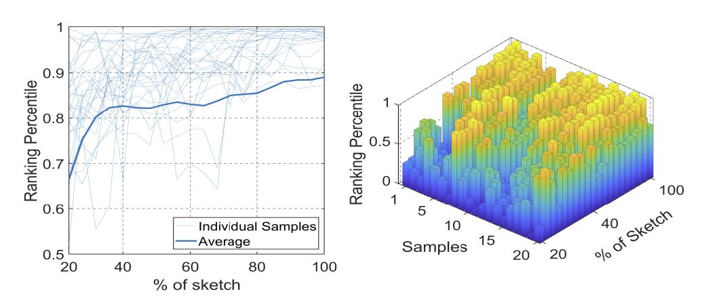
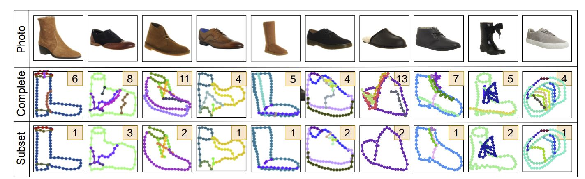
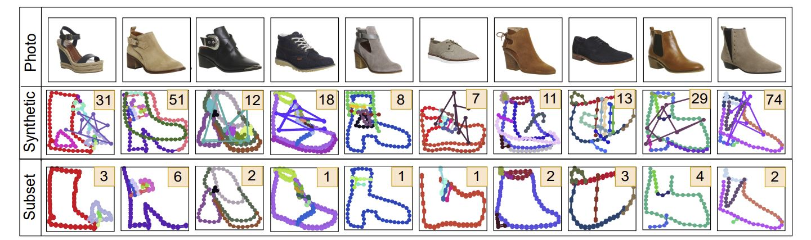

# Sketching without Worrying: Noise-Tolerant Sketch-Based Image Retrieval, CVPR 2022


**Ayan Kumar Bhunia**, Subhadeep Koley, Abdullah Faiz Ur Rahman Khilji , Aneeshan Sain, Pinaki Nath Chowdhury, Tao Xiang, Yi-Zhe Song, “Sketching without Worrying: Noise-Tolerant Sketch-Based Image Retrieval”, IEEE Conf. on Computer Vision and Pattern Recognition (**CVPR**), 2022.

## SketchX_ShoeV2/ChairV2 Dataset: [Download](https://drive.google.com/file/d/1frltfiEd9ymnODZFHYrbg741kfys1rq1/view?usp=sharing)

## Abstract
Sketching enables many exciting applications, notably, image retrieval. The fear-to-sketch problem (i.e., "I can't sketch") has however proven to be fatal for its widespread adoption. This paper tackles this "fear" head on, and for the first time, proposes an auxiliary module for existing retrieval models that predominantly lets the users sketch without having to worry. We first conducted a pilot study that revealed the secret lies in the existence of noisy strokes, but not so much of the "I can't sketch". We consequently design a stroke subset selector that detects noisy strokes, leaving only those which make a positive contribution towards successful retrieval. Our Reinforcement Learning based formulation quantifies the importance of each stroke present in a given subset, based on the extend to which that stroke contributes to retrieval. When combined with pre-trained retrieval models as a pre-processing module, we achieve a significant gain of 8%-10% over standard baselines and in turn report new state-of-the-art performance. Last but not least, we demonstrate the selector once trained, can also be used in a plug-and-play manner to empower various sketch applications in ways that were not previously possible.

## Outline


**Figure:**  (a) While the average ranking percentile increases as the sketching proceeds from starting towards completion, unwanted sudden drops have been noticed for many individual sketches due to noisy/irrelevant strokes drawn. (b) The same thing is visualised with number of samples in the third axis to get an overall statistics on QMUL-Shoe-V2 dataset.

## Architecture


**Figure:**  Illustration of Noise Tolerant FG-SBIR framework. Stroke Subset Selector X(·) acts as a pre-processing module in the sketch vector space to eliminate the noisy
strokes. Selected stroke subset is then rasterized and fed through an existing pre-trained FG-SBIR model for reward calculation, which is optimised by Proximal Policy Optimisation. For brevity, actor-only version is shown here.


## Examples 

**Figure:** Examples showing selected subset performing better (rank in box) than complete sketch from ShoeV2.



**Figure:**  Examples showing ability to perform (rank in box) under synthetic noisy sketch input on ShoeV2.


## Citation

If you find this article useful in your research, please consider citing:
```
@InProceedings{strokesubset,
author = {Ayan Kumar Bhunia and Subhadeep Koley and Abdullah Faiz Ur Rahman Khilji and Aneeshan Sain and Pinaki Nath Chowdhury and Tao Xiang and Yi-Zhe Song},
title = {Sketching without Worrying: Noise-Tolerant Sketch-Based Image Retrieval},
booktitle = {The IEEE Conference on Computer Vision and Pattern Recognition (CVPR)},
month = {June},
year = {2022}
}
```
## Work done at [SketchX Lab](http://sketchx.ai/), CVSSP, University of Surrey. 


